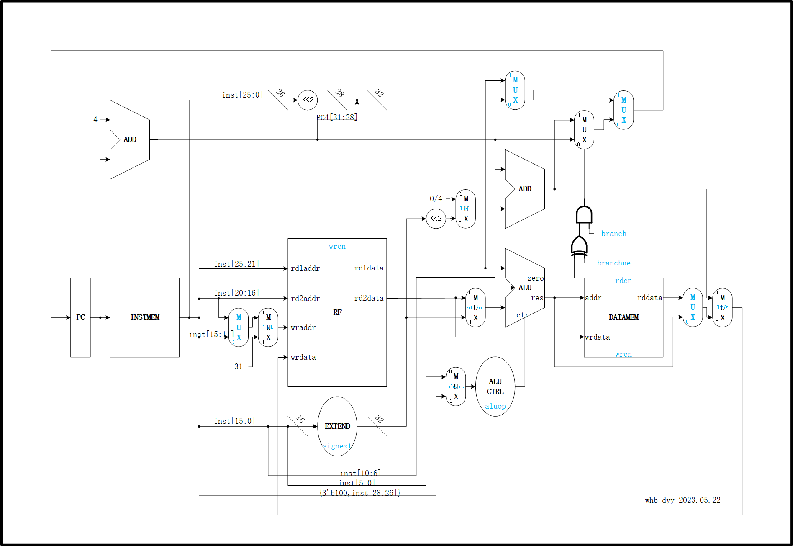

# 资料

## 指令

| | | | | | |
| ---- | ---- | ---- | ---- | ---- | ---- |
| lw | sw |
| add | addi | addiu | sub |
| and | or | xor | andi | ori | xori|
| lui | slt | sll | srl |
| beq | bne |
| j | jal | jr |

## 单周期

## 流水线

## 控制编码

<https://www.elsevier.com/__data/assets/pdf_file/0011/1191377/Appendix-D.PDF>

